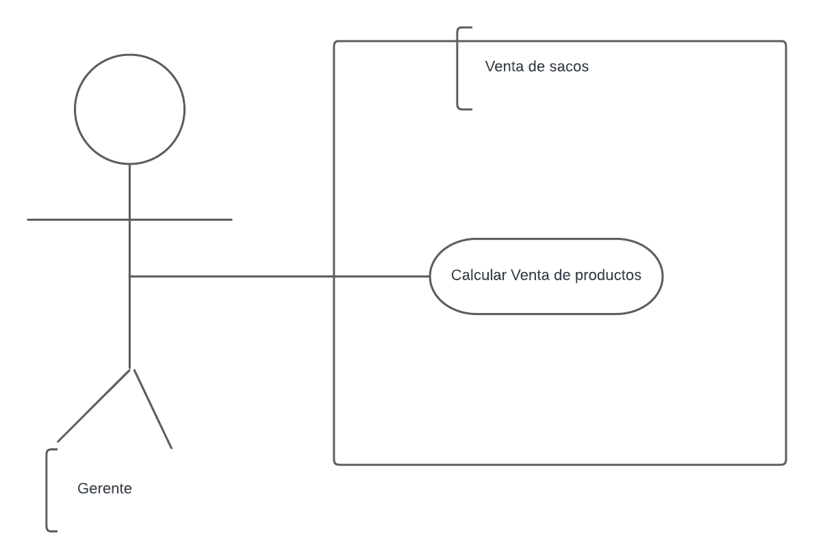
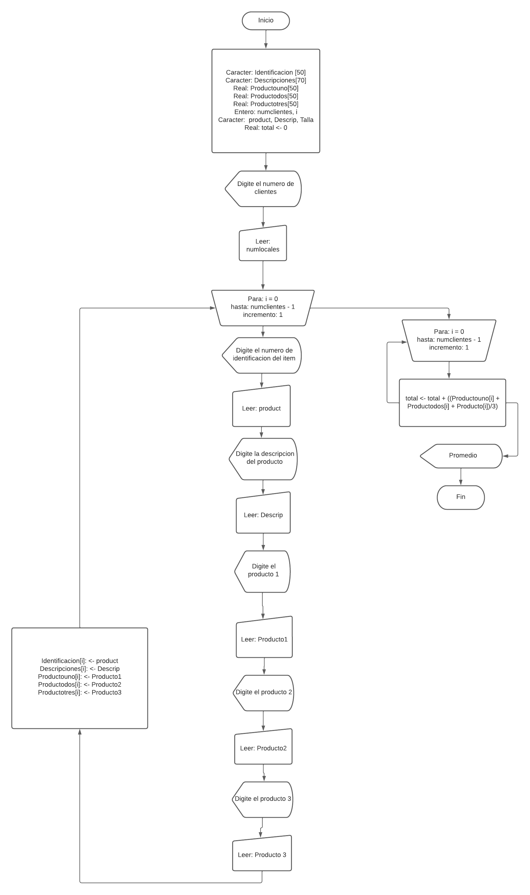

# Venta de sacos
En su labor como programador de software ha sido elegido para el desarrollo de una aplicación que necesita un gestor de tiendas de sacos, donde se desea calcular el total de ventas de 3 productos hecho por diferentes clientes. Al momento de calcular el total de las ventas es necesario que se registre el número de identificación, descripción y talla.

Aclaraciones:

+ Se supondra que la aplicacion solo se requiere para calcular la venta de un unico periodo especifico.
+ Para efecto de mantener la simplicidad del ejemplo no se contemplan manejar persistnecia en el almacenamiento de datos.
+ No se realiza validacion, ni se verifica calidad de los datos ingresados.


## Analisis del Ejercicio
<u> Aproximacion Plantilla de Usuario. </u>


<u> Aproximacion de uso: </u>



<u> Aproximacion diagrama de flujo: </u>


Entender el anterior diagrama no debe presentar mayores problemas. Sin embargo, es conveniente realizar las siguientes
aclaraciones y comentarios
+ Aunque se puede condensar el código incluyendo las instrucciones del segundo “Para” dentro del primero, de manera intencional se ha dejado así intencionalmente para delimitar funcionalmente cada bloque de código.
+ En el algoritmo se captura información, como la identificación, el nombre y el curso, que no se utiliza; sin embargo, esta información se mantiene porque posteriormente puede ser útil para ampliar la funcionalidad de la aplicación.Inicialmente el algoritmo no contempla validaciones como impedir el doble ingreso de un mismo número de identificación.

<u> Aproximacion pseudocodigo: </u>

```
Algoritmo VentaSacos
	Definir Id Como Caracter
	Definir descripcion Como Caracter
	Definir Talla Como Caracter
	Definir producto1 Como Real
	definir producto2 Como Real
	definir producto3 Como Real
	Definir Total como Real
	Escribir "Ingrese el Id del cliente: "
	Leer Id
	Escribir "Ingrese la descripcion delproducto: "
	Leer descripcion
	Escribir "Ingrese la talla del producto: "
	Leer Talla
	Escribir "Ingrese el precio del primer producto: "
	Leer producto1
	Escribir "Ingrese el precio del primer producto: "
	Leer producto2
	Escribir "Ingrese el precio del primer producto: "
	leer producto3
	Total <- (producto1 + producto2 + producto3)
	Escribir "El total de su compra es: "
	Leer Total
FinAlgoritmo 
```